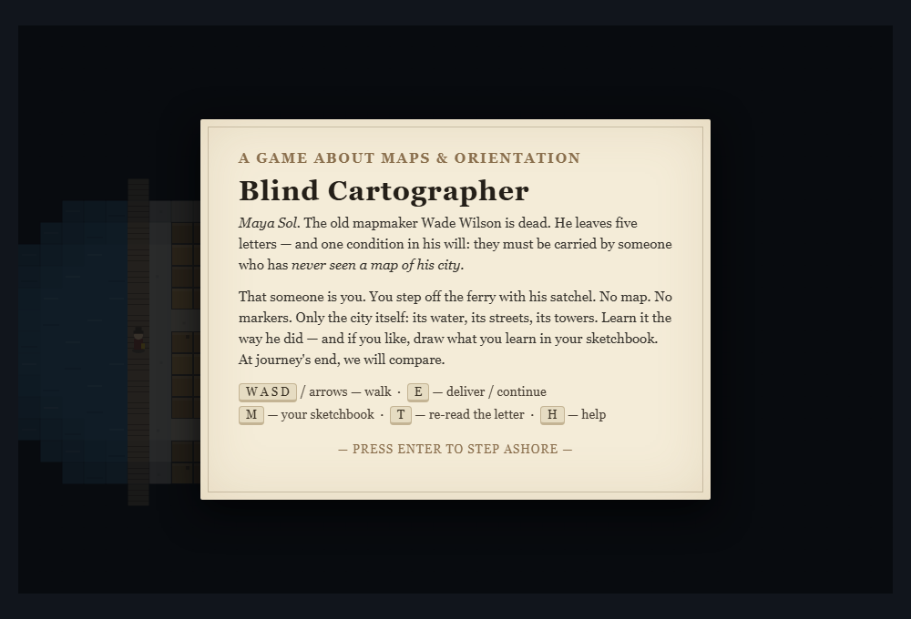
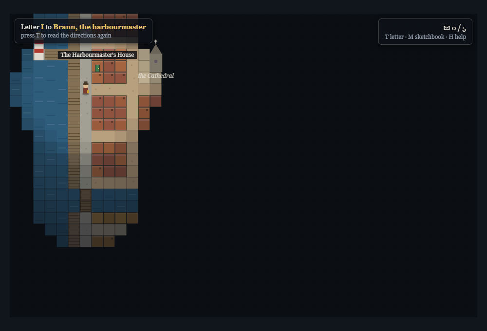
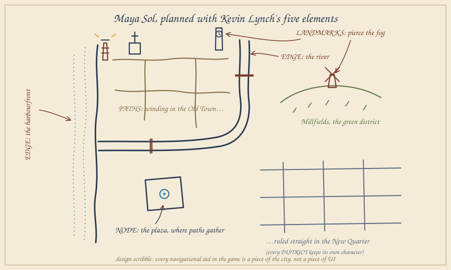
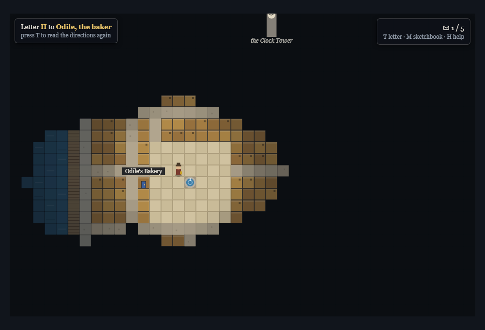
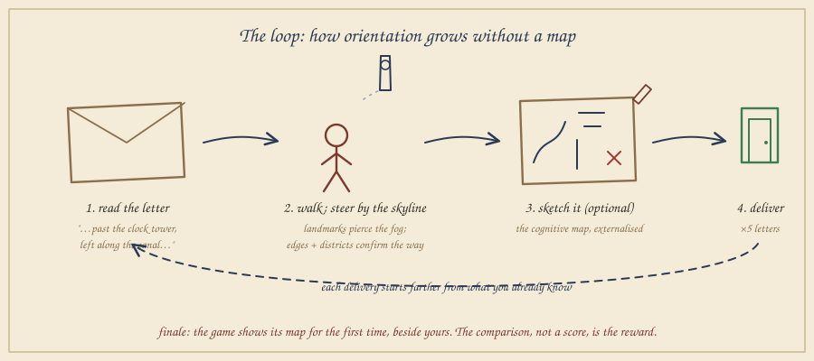
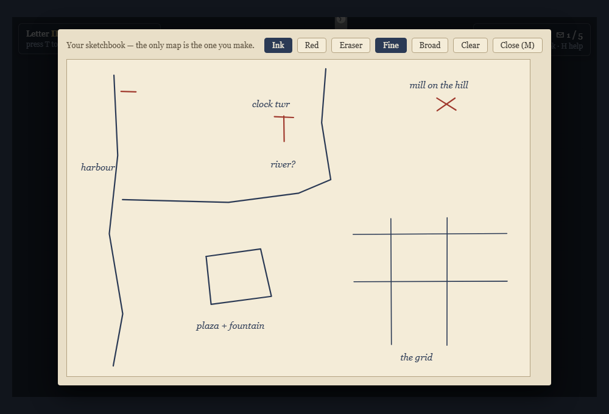
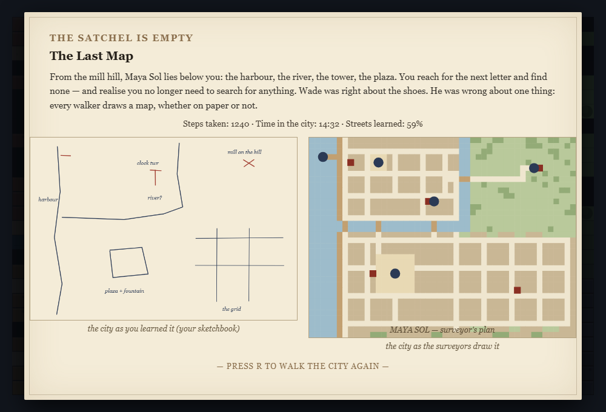

# Post Mortem: *Blind Cartographer*

Seminar: Maps and the City (Summer 2026)
Jaber Rashki Ghaleh No
12452808

Prototype: browser game (`blind-cartographer.html`)

## 1. Introduction: Project Overview and Game Description

*Blind Cartographer* is a small single player exploration game that runs in the browser. The idea behind it came from a simple inversion of something I kept noticing in games that are set in cities, which is that almost all of them hand the player a map first and then fill it with markers and icons. In my prototype I tried to do the opposite, the player gets a whole city but never gets a map of it.

The player takes the role of a courier who arrives by ferry in Maya Sol, a harbor town whose old mapmaker, Wade Wilson, has just passed away. In his will he leaves five letters and only one condition, that they have to be delivered by someone who has never seen a map of his city. Because of that there is no minimap, no compass and no quest arrow in the game. Each envelope is addressed the way people actually give directions to each other in real life, for example *"keep the water at your left hand until the lighthouse rises over the piers."* The player walks around, reads the skyline and, if they want to, draws their own map in a sketchbook inside the game. Only after the last letter is delivered the game shows a map for the first time, which is the surveyor's plan of Maya Sol placed next to the player's own drawing.

*Figure 1: The arrival. Only the ferry landing is known and the rest of Maya Sol is covered in fog.*

*Figure 2: Playing the first letter. The lighthouse is found, and the silhouette of the Cathedral floats above the fog as a distant cue.*

Technically the prototype is a top down 2D game written in one single HTML file (using Canvas and no game engine), with a hand built city that has five districts, a river, a harbor and five landmarks.

## 2. About the Game: What Kind of Game and Why?

It is a short exploration and navigation game that takes around 15 to 25 minutes to finish, and I made it digital on purpose. The central question of the seminar, how orientation is created and whether a map should be shown at all, only becomes a question that can actually be played if the game is able to really hold information back from the player. A board game can not do this in an honest way since the board itself already is a map that is fully visible, and hiding it would need a game master. Fog of war, landmarks that become visible depending on distance and a private sketchbook are very easy for a computer to handle but almost impossible to do with cardboard. So in a way the theory chose the medium for me.

The main design rule I set for myself was that every navigational aid in the game has to be a part of the city and not a part of the interface. Kevin Lynch's five elements of urban legibility (Lynch 1960) became my actual level design checklist (Figure 3). These are paths (a winding web of streets in the Old Town compared to the ruled grid of the New Quarter), edges (the harbor front and the river, which divide the city and force the player to make decisions at the bridges), districts (five wards, each with its own colors, roofs and street patterns), nodes (the fountain plaza where the market streets come together) and landmarks (the lighthouse, cathedral, clock tower and windmill, which are tall enough to be seen above the fog from far away, similar to the towers in *The Legend of Zelda: Breath of the Wild* (Nintendo 2017)).

*Figure 3: Design scribble of Maya Sol, planned as an exercise in Lynch's five elements.*

### Story: What do I want to tell?

The story tries to make the same argument as the mechanics. Wade Wilson spent his whole life drawing maps and at some point stopped believing in them, and his last wish is that his farewell letters are carried by someone who has to learn the city instead of just reading it. Every delivered letter opens a short vignette that connects one recipient to one element of urban form. The harbormaster is connected to the edge that anchored Wade's first survey, the baker to the plaza as a node ("the centre is wherever the bread is still warm"), the clockmaker to the landmark ("mercy for lost men") and the widow Alvey to the grid of the New Quarter, which is easy to read but has no character and which Wade drew himself and later regrets. And last but not least, the miller is connected to the farewell itself: *"the truest map of a city is worn into the soles of one's shoes."* The journey of the player is what makes this claim true, since by the fifth letter they are moving confidently through a city that was nothing but fog an hour before. De Certeau's (1984) distinction between the view from above and the walker down in the streets is basically the arc of the whole game, because the player is the walker the entire time and only receives the view from above at the very end.

*Figure 4: The plaza as a node. The paths gather at the fountain while the clock tower stands on the horizon of the fog.*

### Game Mechanics: How do I want to tell it?

1. No map and fog of war: Space that has not been walked yet is black, while space that has been walked stays dimly remembered. Knowledge of the city can only be earned by moving through it.
2. Landmark reveal: Tall landmarks break through the fog within a wide radius and are shown with their names, so the skyline takes the place of the compass.
3. Letters as navigation: All goals are described in relation to landmarks, edges and districts and never with coordinates or markers.
4. District feedback: When the player crosses into a new ward its name is shown once. This is Lynch's idea of legibility as a moment of arrival, and it is also the only text based orientation aid in the game.
5. The sketchbook (M key): A blank page and some ink. Drawing is optional and never graded, it simply puts on paper the cognitive map that the player is already building in their head anyway.
6. The reveal: After the fifth letter the game shows the surveyor's plan next to the player's sketch (Figure 7). The reward is this comparison and not a score.

*Figure 5: Scribble of the gameplay loop. Read, walk by the skyline, sketch and deliver, with each letter starting further away from what is already known.*

*Figure 6: The sketchbook. The only map in the game is the one the player makes.*

*Figure 7: The ending. The city as the player learned it, next to the city as the surveyors drew it.*

## 3. Formal Note

What went well: Deciding to put everything in one HTML file without an engine kept the scope realistic and made the prototype easy to share, since it only needs a double click to play. Building the city as a 48×36 ASCII grid made it very fast to change things and try them again, and Lynch's checklist turned out to be a really practical tool for level design and not just theory that decorates the project. Writing the letters and building the districts also fed into each other the whole time.

What went wrong: Most of the problems were things that the theory had already predicted. My first direction texts used compass directions like "go north east", and they read like a GPS transcript because nobody actually talks like that. Every letter had to be rewritten around edges and landmarks, and one address in the New Quarter even had to be moved on the grid so that "at the third crossing turn south, first door past the corner" was actually true. The title screen at first showed the whole city behind the menu, which means a game about withholding the map was spoiling its own map before the player even pressed a key, so now the fog covers the title screen as well. Finally, editing the ASCII rows by hand silently created ten walkable tiles that were walled in by buildings. A small validation script that checks the row widths and runs a flood fill from the ferry to all five doors caught what my eyes did not.

### Playtesting

The first plan, which was only text directions and fog and nothing else, did not work. In the early runs the first part was fine because the player just follows the waterfront, but once they moved away from the water the fog turned every decision into blind guessing. Being lost was intended, but being blind was not. The solution ended up becoming the defining feature of the game, which is the tall landmarks that break through the fog. With a silhouette on the horizon "lost" turns into "somewhere relative to the tower," and this is exactly what Lynch claims about landmarks. There were two more findings. First, the fog radius had to become bigger until a full street junction fits inside it, because junctions are where the decisions are made. Second, my plan to score the player's sketch against the real map was cut, since grading turned the sketchbook into homework, while a silent side by side comparison invites the player to reflect instead. The New Quarter stayed confusing on purpose (identical blocks and counting corners) as the lowest point of legibility right before the finale. The next step would be playtesting with people outside of my own circle, mainly to see how much players actually draw.

## 4. Conclusion

Working on this prototype convinced me that orientation is a design material on its own. Taking the map away did not remove wayfinding from the game, instead it moved wayfinding into the architecture, and the city had to become more legible and not less to make up for it. The most valuable lesson for me was how directly a book from 1960 about real cities could work as a manual for level design. And the most satisfying moment is still the reveal at the end, when players hold their wobbly sketch next to the surveyor's plan and recognize every distortion in it as a memory of being lost.

## 5. Bibliography and Inspirations

de Certeau, M. (1984). "Walking in the City." In *The Practice of Everyday Life*. University of California Press.

Gazzard, A. (2013). *Mazes in Videogames: Meaning, Metaphor and Design*. McFarland.

Korzybski, A. (1933). *Science and Sanity* ("the map is not the territory").

Lynch, K. (1960). *The Image of the City*. MIT Press.

Ludography

*Etrian Odyssey* (Atlus 2007), maps drawn by the player

*Firewatch* (Campo Santo 2016), a map without a "you are here"

*Miasmata* (IonFX 2012), navigation by triangulation

*Sea of Thieves* (Rare 2018), charts without markers

*The Legend of Zelda: Breath of the Wild* (Nintendo 2017), towers and landmark navigation

## 6. Contributions

This was a solo project, so I did all of the work myself, from the concept and research to the level design, writing, programming, playtesting and this report.
